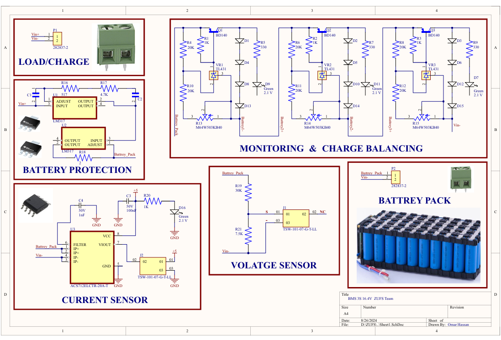
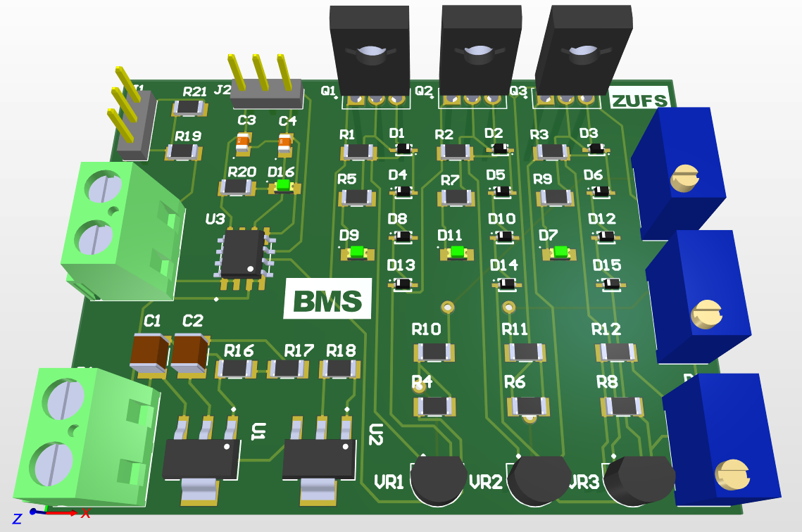
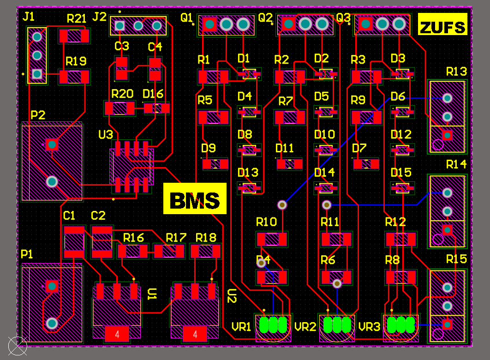

# Battery-Management-System

## Overview
This Battery Management System (BMS) PCB Kit features overcharge and overdischarge protection to extend battery life, cell balancing for optimized performance, temperature monitoring to ensure safe operation, power monitoring for real-time energy efficiency, and a compact design suitable for various applications.

## Schematic
Below is the schematic diagram for the Battery Management System (BMS) PCB Board, showcasing the connections and components used.



## PCB Layout
The double layers layout of the PCB, showing the placement of components and routing.



## 3D View
A 3D view of the Battery Management System (BMS) PCB Board, giving a realistic representation of the final product.



## Features
- **Custom Design:** Tailored for Battery Management System (BMS) with optimized component placement and routing.
- **Compact Size:** Designed to fit into tight spaces while maintaining functionality.
- **Efficient Routing:** High-quality routing for signal integrity and minimal interference.
- **3D Visualization:** Allows for a clear preview of the board before manufacturing.

## How to Use
- **Download Files:** Clone the repository or download the files directly.
- **Open in Altium Designer:** Open the project files in Altium Designer to view and modify.
- **Manufacture:** Use the provided Gerber files to manufacture the PCB.

## Clone this Repository
To clone this repository, use the following command:

```bash
`git clone https://github.com/omarhassan2/Battery-Management-System.git`